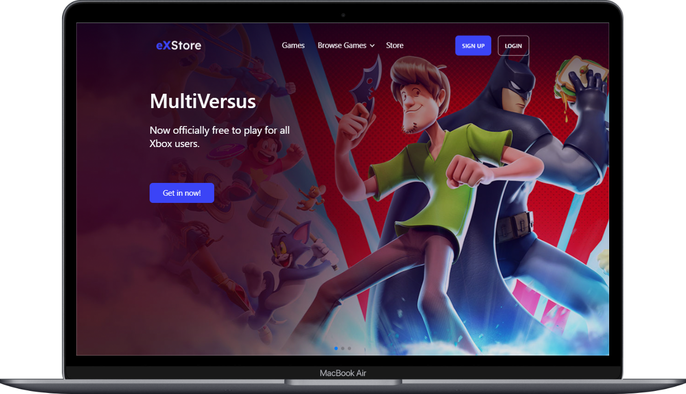

<h1 align="center">
  eXStore 👾
</h1>

  <a href="#-layout">Layout</a>&nbsp;&nbsp;&nbsp;|&nbsp;&nbsp;&nbsp;
  <a href="#-tecnologias">Tecnologias</a>&nbsp;&nbsp;&nbsp;|&nbsp;&nbsp;&nbsp;
  <a href="#-projeto">Projeto</a>&nbsp;&nbsp;&nbsp;|&nbsp;&nbsp;&nbsp;
  <a href="#-licença">Licença</a>&nbsp;&nbsp;&nbsp;|&nbsp;&nbsp;&nbsp;
  <a href="#-contato">Contato</a>

 

## 🎨 Layout

Aqui você pode conferir o layout do projeto.  

[👉 Link para visualizar a pagina completa](https://exstore-pied.vercel.app/)

 
   

---

## 🚀 Tecnologias

Esse projeto foi desenvolvido com as seguintes tecnologias:

 
 
 

## 💻 Projeto

O site foi criado com as tecnologias <strong> React, Tailwind e uma biblioteca de componentes para tailwind, DaisyUI</strong>. Isso garantindo uma experiência de usuário suave e interativa, com uma interface moderna e <strong>responsiva</strong>, que se adapta a todos os dispositivos, <strong>desde desktops até smartphones</strong>.

## 📝 Licença

Esse projeto está sob a licença MIT. Veja o arquivo [LICENSE](LICENSE) para mais detalhes.

## 🌐 Contato

 

---

Feito com ♥ by Gabriel Gonçalves 🖖 &nbsp;&nbsp;&nbsp;|&nbsp;&nbsp; <a href="#--exstore-">Voltar para o Inicio ⬆️ </a>
